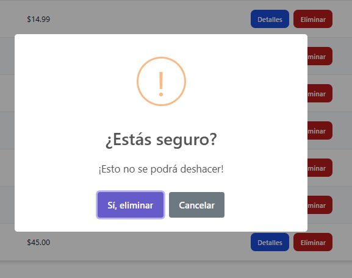

# Productos - App

CRUD de productos con React JS y Tailwind CSS

## API

Utiliza la API de [Dummy JSON](https://dummyjson.com) para manejar los productos.

## Instalacion

1. **Clonar el repositorio**

   Abre tu terminal y clona el repositorio:

   git clone https://github.com/tu-usuario/productos-app.git
   
2. **Instalar las dependencias**

Dirígete a la carpeta del proyecto:

cd productos-app

2. **Instalar las dependencias**

Ejecuta:

npm install

3. **Corre la aplicación**

   npm start

**Credenciales de acceso**
Usuario: emilys
Contraseña: emilyspass

